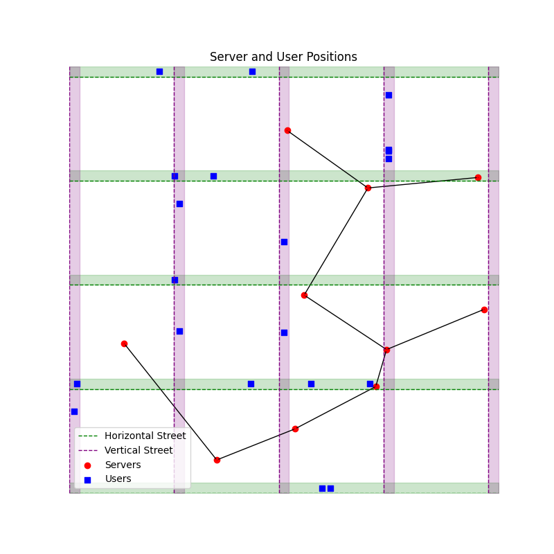

# Distributed Dependency-Aware Task Offloading and Service Caching in Cloudlet-Based Edge Computing

Code for the paper *"Distributed Dependency-aware Task Offloading and Service Caching in
Cloudlet-based Edge Computing Networks"* (Golzari Oskoui & Sansò, Polytechnique Montréal) — a
**fully distributed** reinforcement-learning framework where each cloudlet independently decides
**where to run each task** of a DAG application **and which services to cache**, with no central
controller and minimal communication overhead.

> **In one line:** per-cloudlet **DQN** agents, sped up by **guided action shaping** (bias early
> exploration toward cloudlets that already cache the needed service), plus a lightweight
> **EMA-based distributed caching** rule — together cutting average application completion time by
> **~80%** versus a nearest-server baseline.

---

## The problem

Modern edge applications (autonomous driving, AR, AI pipelines) are **DAGs of dependent tasks**, and
each task needs a specific **software service** preloaded on the executing cloudlet. Two decisions are
tightly coupled:

- **Offloading** — which cloudlet runs each task. Dependent tasks on different cloudlets must ship
  intermediate data over the backhaul, so placement and inter-cloudlet transfer interact.
- **Service caching** — which services each cloudlet keeps (capacity $K_s < Q$). If a task's service
  isn't cached locally, it incurs a service-loading delay.

Solving them jointly and optimally is **NP-hard** with a search space of $\mathcal{O}(S^{MV}\,2^{QS})$
— about $10^{130}$ for a modest 10-cloudlet / 10-service / 10-task setting. Prior joint approaches rely
on a **centralized controller with global knowledge**, which doesn't scale and adds communication
overhead. This work asks: *can cloudlets make good offloading and caching decisions locally?*



*Simulated environment: cloudlets (red) and users (blue) over a 1 km × 1 km area; black lines are the
inter-cloudlet backhaul. Each user offloads its DAG to its nearest cloudlet, which then decides
placement across the network.*

---

## Approach

A **distributed** design: every cloudlet runs its own DQN offloading agent and its own caching module,
coordinating only through occasional lightweight broadcasts of caching state.

```
   ┌──────────────────── per cloudlet (no central controller) ─────────────────────┐
   │                                                                                │
   │   OFFLOADING  (Deep Q-Network, per-task decision)                              │
   │     state = [ CPU cycles | input size | predecessor-cloudlet vector |          │
   │               global cache config | current-task service | successor services ]│
   │     action = choose execution cloudlet (1..S)                                  │
   │     reward = terminal ±1 vs. an ADAPTIVE deadline (tightens as the agent wins) │
   │     return = G_t = r + γ · Σ_{successors} G_t'   (DAG-structured credit)       │
   │                                                                                │
   │     ┌── GUIDED ACTION SHAPING ──────────────────────────────────────────────┐ │
   │     │  with prob β  → random cloudlet that caches the required service        │ │
   │     │  else         → ε-greedy on learned Q-values    (β decays over training)│ │
   │     └─────────────────────────────────────────────────────────────────────────┘ │
   │                                                                                │
   │   CACHING  (local, EMA popularity×cost ranking)                                │
   │     H_{q,s} ← H_{q,s} + α( 𝟙[service=q]·load_cost_q − H_{q,s} )                 │
   │     cache the top K_s services by H_{q,s};  broadcast on change                │
   └────────────────────────────────────────────────────────────────────────────────┘
```

Two ideas make the distributed scheme work:

1. **DAG-aware state without a graph network.** Instead of message passing, the state directly encodes
   structure: a vector of **predecessor task destinations** (where upstream tasks ran) and an
   aggregated vector of **successor service requirements** (what downstream tasks will need). This lets
   a plain DQN reason about dependencies and steer related tasks together.
2. **Guided action shaping for fast convergence.** Early on, the only reliable signal is *which
   cloudlets cache the needed service*, so the agent samples from those with probability β; as it
   learns true delays/queues/links, β decays and it trusts its own Q-values. This accelerates training
   and is the single largest contributor to the final result (see ablation).

**Timescale separation** stabilizes the coupled system: offloading adapts fast while caching drifts
slowly via the EMA, so as the policy settles, service demand becomes predictable and caching converges.

---

## Key results

All results average over **10 independent runs** (random topology/parameters each run); error bars are
95% confidence intervals. Default scenario: **20 users, 10 cloudlets, 10 services**, DAGs from the
**Alibaba Cluster Trace 2018**, cache capacity $K_s = 2$.

### Ablation — each component compounds (≈80% total reduction)

Starting from the non-learning **Nearest-server** baseline (~0.37 s) and adding one component at a time:

| Configuration | Avg. completion time | vs. Nearest |
|---|---|---|
| Nearest-server baseline | ~0.37 s | — |
| + basic DQN (task features only) | ~0.23 s | −40% |
| + service-awareness (current + successor services) | ~0.21 s | −43% |
| + dependency-awareness (predecessor destinations) | ~0.15 s | −59% |
| + **guided action shaping** *(full method)* | **~0.075 s** | **−80%** |

And **dynamic vs. static caching:** replacing static caching (~0.25 s) with the EMA-based distributed
caching rule drops completion time to **~0.075 s** — confirming the caching design carries much of the
gain.

### Balances all latency components

A component breakdown (computation / service-loading / waiting latency) shows the greedy baseline drives
service-loading to zero but pays elsewhere; the proposed method **doesn't minimize any single component**
— it balances all three to reach the lowest total time.

### Robust across system conditions

Sweeps confirm the method stays best as conditions change:
- **More cloudlets** → lower latency (more placement/caching flexibility); the proposed method exploits
  the larger decision space better than greedy/heuristics.
- **More services** → latency rises for all; the proposed method degrades gracefully and, once services
  exceed total network cache capacity ($S \times K_s = 20$), stays competitive with greedy.
- **Larger data sizes** → proposed method is least sensitive (data-aware placement).
- **Larger service sizes** → service-aware methods (proposed, greedy) grow slowest.
- **Higher inter-cloudlet bandwidth** → gaps shrink (service-loading matters less), and the agent
  *automatically* adapts its policy to the regime.

### Orders-of-magnitude cheaper than optimal

Per-task offloading inference ≈ $1.5\times10^5$ ops (~150 µs on a 1 GHz core) and caching ≈ 200 ops,
versus ≈ $10^{130}$ for exact joint optimization — while scaling **linearly** with the number of
cloudlets and being independent of the number of users per decision.

---

## Method details

**DQN offloading agent (per cloudlet).** State
`[b, d, A^pred (S-vec), C (global cache config, Q·S), Z (current service, Q), Z^succ (successor services, Q)]`,
dimension $SQ + S + 2Q + 3$. Action ∈ {1..S}. Terminal reward ±1 against an adaptive deadline
$\bar{D}_m$ (updated toward the running mean completion time, so success keeps tightening the target).
DAG-structured returns $G_t = r + \gamma\sum_{t'\in\text{Succ}(t)}G_{t'}$ stored in a replay buffer;
network updated every $N_{\text{update}}$ iterations by minimizing $\sum_i (G_i - Q(s_i,a_i;\theta))^2$
(Adam).

**Guided action shaping.** $a \leftarrow$ random service-caching cloudlet w.p. β; argmax-Q w.p.
$(1-β)(1-ε)$; random w.p. $(1-β)ε$. $β = \max(β_{\min}, β_0\,δ_β^{\,i})$.

**Distributed caching.** Per cloudlet, online EMA $H_{q,s}$ of (service request × loading cost);
every $N$ updates, cache the top $K_s$ services by $H_{q,s}$ and broadcast changes. $\mathcal{O}(SQ\log Q)$.

**Default hyperparameters.** γ = 0.9, lr = 0.001, ε = 0.01, β₀ = 0.9, β_min = 0.1, δ_β = 0.995,
batch = 1024, $N_{\text{update}}$ = 100, 2 hidden layers × 64, tanh, Adam, 30 000 steps.

---

## Baselines

**Random** · **Nearest** (closest cloudlet) · **Nearest-with-Service / Greedy** (closest cloudlet that
caches the service) · **DQN-WDSA** (DQN without dependency/service awareness) · **Actor–Critic
(unguided)** (dependency-aware AC from prior work) · **Actor–Critic (guided)** (AC + our guidance) ·
**Unguided Proposed** (our state, no guidance). All baselines use the same local-information assumptions
— no method is given global knowledge.

---

## Quickstart

Requires Python 3.9+.

```bash
python -m venv env && source env/bin/activate
pip install -r requirements.txt

# Run a configuration (algorithm & parameters set in input.py; overridable via -key value)
python main.py -folder demo_run -nuser 20 -nserver 10

# Plot / aggregate
python plot.py
```

Results are written under `results/<folder>/`. See `input.py` for the full parameter and algorithm list.

---

## Repository map

```
main.py                     # experiment entry point (guided-RL offloading loop)
simulator.py                # cloudlet edge simulation core
server.py / user.py / task.py   # cloudlets (+ caching module), users, DAG tasks
input.py                    # simulation & learning hyperparameters

dqn.py, agent.py, brain.py  # DQN offloading agent
a2c.py, rl.py, lstm.py      # Actor-Critic / alternative RL baselines
gat.py, gcn.py              # graph-encoder baselines
optimization.py, solver*.py # ILP / optimal reference
plot*.py, results.py        # analysis & plotting
Montage_25.json, dag_uniform.json   # sample / synthetic DAGs
```

---

## Tech stack

Python · PyTorch · SimPy · NetworkX · NumPy / SciPy / pandas · Matplotlib · PuLP (ILP reference)

---

## Citation / Authors

**Mohammad Reza Golzari Oskoui** and **Prof. Brunilde Sansò** — Department of Electrical Engineering,
Polytechnique Montréal. Supported by NSERC (DG 05734). This journal paper extends the authors' earlier
MobiWac conference work by adding service caching and a distributed, guided learning framework.
*(Please cite the published version — see the paper for the full reference.)*
